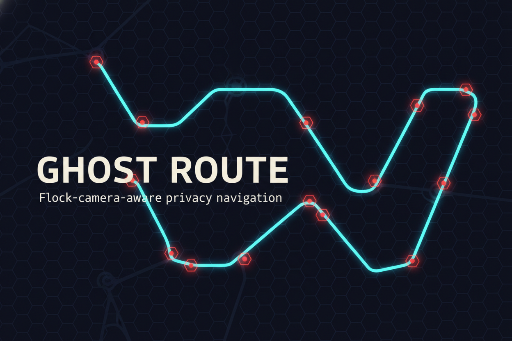
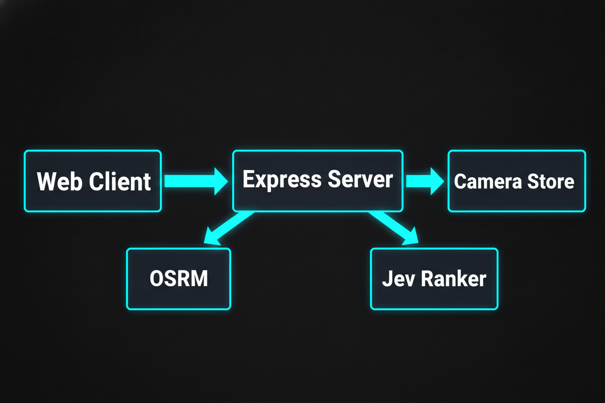

<h1 align="center">Ghost Route</h1>

<p align="center"><strong>Flock-camera-aware routing.</strong> See ALPR cameras near you and get driving routes ranked by camera exposure — take the path with the fewest cameras, ideally zero.</p>

<p align="center">
  <a href="LICENSE"></a>
  
  
  
</p>

<p align="center">
  
</p>

## Why it exists

Flock Safety ALPR cameras log every passing plate. Ghost Route makes that exposure visible and avoidable: it overlays known cameras on a map and ranks real driving routes by how many you'll pass — with AI-powered ranking when you bring a key, and a solid deterministic fallback when you don't.

| | |
|---|---|
| 🗺️ | **Camera-aware map** — 650 real ALPR nodes (Austin metro) with exposure-radius overlays |
| 🛣️ | **Ranked routes** — up to 5 candidates scored by exposure first, drive time second |
| 🧠 | **JEV ranking + heuristic fallback** — TypeSafe `system_one` choice head live, deterministic scoring offline |
| 👁️ | **Seen-risk meter** — probability of being observed by ≥1 camera, per route and per turn |
| 🔑 | **BYOK** — paste your key in the app, no server config needed |
| 📦 | **Self-hostable** — one repo, two processes, no vendor lock-in |

## Quickstart

```sh
git clone https://github.com/DevvGwardo/ghost-route.git
cd ghost-route
npm install

# Terminal 1 — API (http://127.0.0.1:8801)
npm run dev:server

# Terminal 2 — map UI (http://127.0.0.1:5174)
npm run dev:client
```

Open the UI, click the map to set origin then destination (Alt-click restarts), or use the From/To search — then **Find clean route**. Green routes have zero exposures; amber ones don't. Tap any route for turn-by-turn steps with per-step exposure %.

> No key required. Everything works out of the box in heuristic mode — a key only upgrades ranking quality.

## How avoidance works

<p align="center">
  
</p>

1. **OSRM** returns up to 3 alternative road routes.
2. **Scoring** — cameras within `bufferMeters` of the polyline dominate: `score = exposures × 10000 + distanceM`.
3. **Detours** — if every alternative is exposed, two waypoint-detour candidates (±1000 m perpendicular offsets) are re-routed via OSRM and re-scored.
4. **Ranking** — Jev picks the winner; below `CONFIDENCE_THRESHOLD` (default `0.40`) the heuristic best is served instead, flagged `fallbackUsed: true`.

## Bring your own key

Two ways to activate live JEV ranking (never required):

1. **In the app (recommended)** — Route options → JEV key field → paste → Save → **Test**. Stored only in your browser's `localStorage`, sent as an `x-typesafe-key` header. The chip reads "JEV live" only when the key verifies *and* the last ranking was live.
2. **On the server** — set `TYPESAFE_API_KEY` in `.env` (see `.env.example`; request a key at typesafe.ai early access).

Precedence per request: `x-typesafe-key` header → `TYPESAFE_API_KEY` env → none (`fake` mode). The server never logs, persists, or echoes keys.

<details>
<summary>Troubleshooting a pasted key</summary>

- `GET /api/system/verify` with the `x-typesafe-key` header returns `{ valid, confidence?, error? }` (`unauthorized` = 401/403 from TypeSafe, `unreachable` = network/timeout). The UI Test button calls this.
- Routes showing `fallback` + `heuristic` mean the key was present but Jev was unreachable, low-confidence, or invalid — check Test output.
- `GET /api/system/status` shows `{ mode, threshold, cameraCount, osrm }` for the current key.

</details>

## API

- `GET /api/health` → `{ ok, jev: { mode: 'jev'|'fake', threshold } }`
- `GET /api/cameras?bbox=minLon,minLat,maxLon,maxLat&limit=500`
- `POST /api/cameras` `{ lat, lon, address? }` — crowd-source a camera
- `POST /api/route` `{ origin, destination, avoidFlock=true, bufferMeters=150 }` → `{ routes, rankedBy, jevMode }`
- `GET /api/system/status` → `{ mode, threshold, cameraCount, osrm }`
- `GET /api/system/verify` (header `x-typesafe-key`) → `{ mode, valid, confidence?, error? }`

## Camera data

`server/data/flock-cameras.json` — **650 real ALPR nodes** from OpenStreetMap (`surveillance:type=ALPR`, Austin metro), 591 with `manufacturer=Flock Safety` → `verified:true`. Refresh anytime:

```sh
node scripts/import-deflock.mjs               # Overpass → normalize → merge, de-duped
node scripts/import-deflock.mjs --synthetic   # regenerate the seed
node scripts/repro-avoid.mjs                  # avoidance proof: detour 3 → 0 exposures
```

## Self-hosting notes

- **Ports** — server `8801` (`PORT` in `.env`), client `5174`. In dev the Vite proxy forwards `/api`, so no extra config; for split deploys set `VITE_API_URL` before `npm run build -w client`.
- **Privacy** — origin/destination are POSTed to the server (and to OSRM for routing). Self-host both if that matters to you; the TypeSafe key travels as a header and is never logged or persisted server-side.
- **Production hardening** (defaults are local-dev grade) — restrict CORS origins in `server/src/index.ts`, put auth in front of `POST /api/cameras`, note rate limits + camera store are in-memory (single instance), and replace the OSRM demo + Nominatim with hosted instances before real traffic.

## Attribution

- Map tiles: [CARTO Voyager](https://carto.com/) (free, no key) + © OpenStreetMap contributors. Routing: OSRM demo (rate-limited, not for production). Geocoding: Nominatim (demo-grade volume; heavy use needs your own instance).
- Camera nodes derived from OpenStreetMap (`surveillance:type=ALPR`, ODbL) — keep the OSM attribution when reusing the dataset.

## License

MIT — see [LICENSE](LICENSE).
