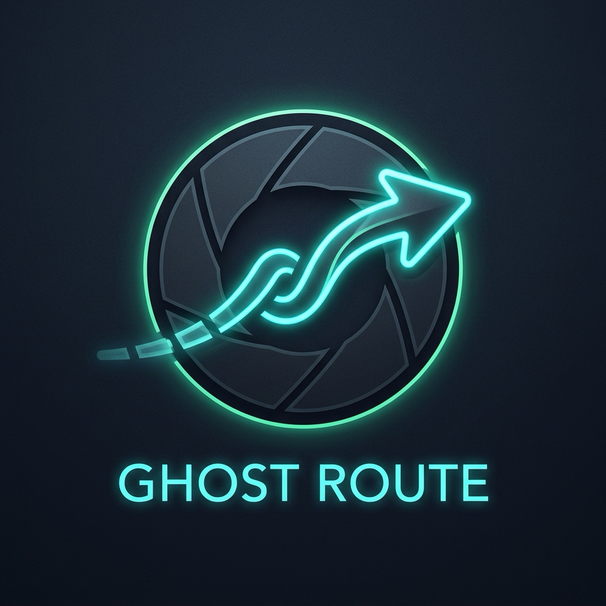
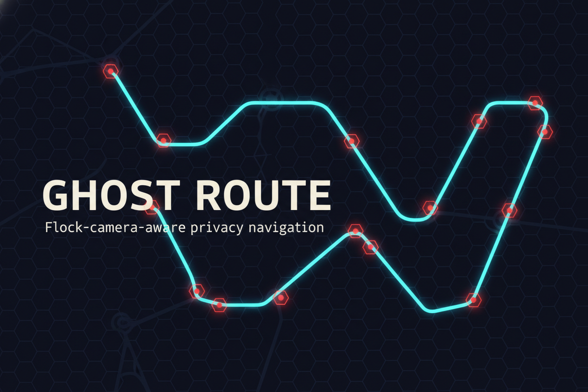
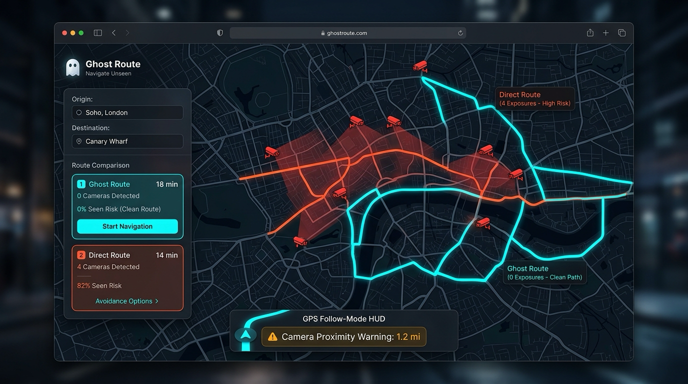
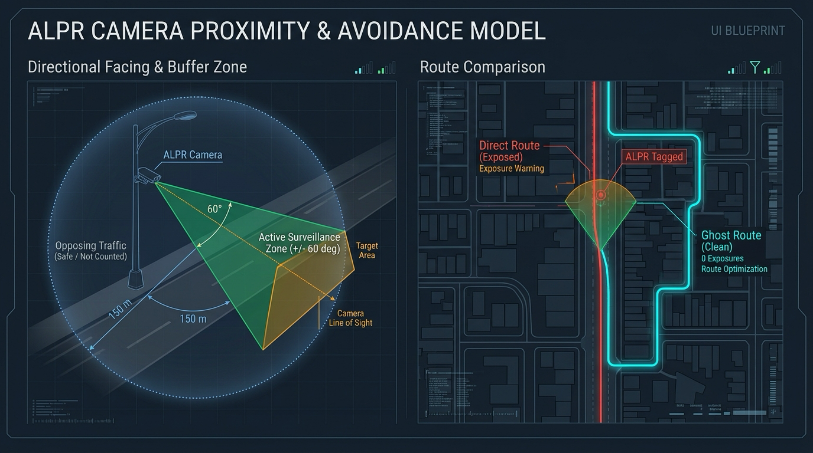
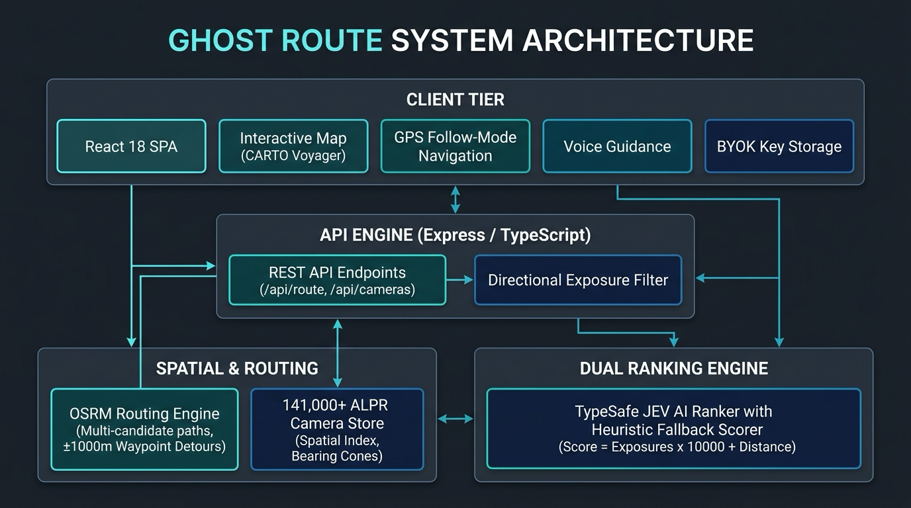

<p align="center">
  
</p>

<h1 align="center">Ghost Route</h1>

<p align="center"><strong>Flock-camera-aware routing.</strong> See ALPR cameras near you and get driving routes ranked by camera exposure — take the path with the fewest cameras, ideally zero.</p>

<p align="center">
  <a href="LICENSE"></a>
  
  
  
</p>

<p align="center">
  
</p>

## Why it exists

Flock Safety ALPR cameras log every passing plate. Ghost Route makes that exposure visible and avoidable: it overlays known cameras on a map and ranks real driving routes by how many you'll pass — with AI-powered ranking when you bring a key, and a solid deterministic fallback when you don't.

<p align="center">
  
</p>

| | |
|---|---|
| 🗺️ | **Camera-aware map** — 141,000+ real ALPR nodes nationwide with exposure-radius overlays |
| 🛣️ | **Ranked routes** — up to 5 candidates scored by exposure first, drive time second |
| 🧠 | **JEV ranking + heuristic fallback** — TypeSafe `system_one` choice head live, deterministic scoring offline |
| 👁️ | **Seen-risk meter** — probability of being observed by ≥1 camera, per route and per turn |
| 🧭 | **Follow-mode navigation** — the map tracks your GPS and heading, marks the next turn, highlights cameras ahead, and reroutes from your live position if you leave the route |
| 🔊 | **Voice guidance** — opt-in spoken maneuvers, camera alerts, reroute and arrival cues (banner speaker toggle) |
| ↗️ | **Direction-aware exposure** — cameras with a known facing only count when you actually travel through their bearing |
| 🔑 | **BYOK** — paste your key in the app, no server config needed |
| 📦 | **Self-hostable** — one repo, two processes, no vendor lock-in |

## Quickstart

```sh
git clone https://github.com/DevvGwardo/ghost-route.git
cd ghost-route
npm install

# Terminal 1 — API (http://127.0.0.1:8801)
npm run dev:server

# Terminal 2 — map UI (http://127.0.0.1:5174)
npm run dev:client
```

Open the UI, click the map to set origin then destination (Alt-click restarts), or use the From/To search — then **Find clean route**. Green routes have zero exposures; amber ones don't. Tap any route for turn-by-turn steps with per-step exposure %.

> No key required. Everything works out of the box in heuristic mode — a key only upgrades ranking quality.

## How avoidance works

<p align="center">
  
</p>

1. **OSRM Candidate Generation** — returns up to 3 alternative road routes between your origin and destination.
2. **Direction-Aware Exposure Scoring** — cameras within `bufferMeters` of the polyline dominate: `score = exposures × 10000 + distanceM`. Most of the 141,000+ camera nodes carry a facing angle (`direction`), and a camera only triggers an exposure when the vehicle travels through its ~±60° optical surveillance cone. Opposing traffic and non-intersecting street angles are not penalized.
3. **Detour Synthesis** — if every alternative route has camera exposure, perpendicular waypoint offsets (±1000 m) are synthesized, re-routed through OSRM, and re-scored.
4. **Dual-Brain Ranking** — the TypeSafe JEV AI model (`system_one`) evaluates the candidate routes; if confidence falls below `CONFIDENCE_THRESHOLD` (default `0.40`) or offline, the deterministic heuristic best is served seamlessly (`fallbackUsed: true`).

Pass `respectDirection: false` to score every camera omnidirectionally (buffering all cameras regardless of facing).

## System Architecture

<p align="center">
  
</p>

Ghost Route is built as a lightweight, privacy-first navigation stack:
- **Client Tier**: React 18 SPA with CARTO Voyager vector tiles, real-time GPS Follow-Mode navigation HUD, directional turn-by-turn alerts, and client-side BYOK key management (`localStorage`).
- **API Engine (Express / TypeScript)**: Type-safe REST endpoints (`/api/route`, `/api/cameras`), request validation via Zod, rate limiting, and directional exposure filtering.
- **Spatial & Routing Engine**: OSRM routing backend supporting multi-alternative generation and perpendicular detour synthesis (±1000m offsets) evaluated against an in-memory R-tree of 141,000+ verified ALPR camera nodes.
- **Dual Ranking Engine**: TypeSafe JEV AI ranker (`system_one` decision head) with automatic low-confidence fallback to deterministic scoring (`score = exposures × 10000 + distanceM`).

## Route options

Open **Route options** under the From/To fields:

| Option | Default | Effect |
|---|---|---|
| **Drive / Walk / Bike** | Drive | OSRM travel profile. A backend with no graph for the mode returns driving directions and says so. |
| **Avoid Flock cameras** | on | Off = score routes by cameras present (no detour search), so you can compare the exposure of the direct path. The sheet then reads "Camera avoidance is off" rather than pretending no clean route exists. |
| **Buffer radius** | 150 m | How far from the polyline a camera still counts (50–5000 m, matching the server). Wider = more conservative avoidance, longer detours. |
| **Only count cameras facing the route** | on | Off restores the fully omnidirectional model (every camera in the buffer counts). |
| **Verified cameras only** | off | On = user-submitted (unverified) nodes no longer affect the route. Off keeps every camera counted. |
| **Brands** | all | Chips derived from the cameras currently in view; selecting any narrows routing to those brands. |
| **JEV key** | none | BYOK key for AI ranking; everything works without it. |

Every one of these is also a `POST /api/route` field (`profile`, `cameraFilter`, `respectDirection`, …) and every addition is optional — old clients keep working unchanged. Options apply on the next **Find clean route**; changing them never silently re-routes. Preferences persist in `localStorage`, and the current route is continuously written to the URL hash (`#r=lat,lon~lat,lon&prof=…`) so the address bar is a shareable link — **Share** copies it, and opening one hydrates the endpoints and options on boot.

Recent trips and starred places are offered right in the From/To fields (browser-only; nothing about your trips is stored server-side).

## Bring your own key

Two ways to activate live JEV ranking (never required):

1. **In the app (recommended)** — Route options → JEV key field → paste → Save → **Test**. Stored only in your browser's `localStorage`, sent as an `x-typesafe-key` header. The chip reads "JEV live" only when the key verifies *and* the last ranking was live.
2. **On the server** — set `TYPESAFE_API_KEY` in `.env` (see `.env.example`; request a key at typesafe.ai early access).

Precedence per request: `x-typesafe-key` header → `TYPESAFE_API_KEY` env → none (`fake` mode). The server never logs, persists, or echoes keys.

<details>
<summary>Troubleshooting a pasted key</summary>

- `GET /api/system/verify` with the `x-typesafe-key` header returns `{ valid, confidence?, error?, status?, detail? }`. The Test button calls this, and the error names the real cause: `unauthorized` (401/403), `invalid-request` (TypeSafe rejected the body, e.g. 422), `rate-limited` (429), `upstream-error` (5xx), `timeout` (TypeSafe was reachable but slow), `unreachable` (network only).
- Keys are bearer tokens in the hundreds of characters; a 200-char cap used to drop real ones silently. Keys up to 4096 chars are accepted.
- Routes showing `fallback` + `heuristic` mean the key was present but Jev was unreachable, timed out, was low-confidence, or invalid — check Test output. `429`/`529` from TypeSafe are retried once with backoff (within the request's budget).
- `GET /api/system/status` shows `{ mode, threshold, cameraCount, osrm }` for the current key.

</details>

## API

- `GET /api/health` → `{ ok, jev: { mode: 'jev'|'fake', threshold } }`
- `GET /api/cameras?bbox=minLon,minLat,maxLon,maxLat&limit=500` (+ `verifiedOnly=1`, `brand=`, `source=`, applied before decimation)
- `POST /api/cameras` `{ lat, lon, address? }` — crowd-source a camera (needs `x-camera-token` when `CAMERA_WRITE_TOKEN` is set)
- `POST /api/cameras/:id/report` `{ reason }` → `{ camera, reports, reasons }`; `DELETE /api/cameras/:id` → `{ deleted }`
- `POST /api/route` `{ origin, destination, avoidFlock=true, bufferMeters=150, respectDirection=true, profile='driving', cameraFilter? }` → `{ routes, rankedBy, jevMode, profile?, profileFallback?, cleanSearch }`
- `GET /api/system/status` → `{ mode, threshold, cameraCount, cameraCounts, routingBackend, osrm }`
- `GET /api/system/verify` (header `x-typesafe-key`) → `{ mode, valid, confidence?, error? }`

## Camera data

`server/data/flock-cameras.json` — **~141,000 real ALPR nodes nationwide** from OpenStreetMap (`surveillance:type=ALPR`, same upstream as deflock.me / Finding Flock), ~114,000 with `brand: Flock Safety` → `verified:true`. Refresh anytime:

```sh
node scripts/import-deflock.mjs --snapshot  # hourly US snapshot (140k+ nodes, reliable)
node scripts/import-deflock.mjs --us        # tile 15 metros via Overpass (slow, rate-limited)
node scripts/import-deflock.mjs --metro dallas # one metro via Overpass
node scripts/repro-avoid.mjs                # avoidance proof: detour 3 → 0 exposures
```

## Self-hosting notes

- **Ports** — server `8801` (`PORT` in `.env`), client `5174`. In dev the Vite proxy forwards `/api`, so no extra config; for split deploys set `VITE_API_URL` before `npm run build -w client`.
- **Privacy** — origin/destination are POSTed to the server (and to OSRM for routing). Self-host both if that matters to you; the TypeSafe key travels as a header and is never logged or persisted server-side.
- **Budgets and caching** — `ROUTE_BUDGET_MS` (12000) caps the clean-route search, `JEV_BUDGET_MS` (10000) is the shared ranking+exposure deadline, `JEV_CACHE_TTL_MS` (60000, `0` disables) caches JEV answers per identical candidate set. A cut-short search still returns routes and flags `cleanSearch.aborted`.
- **Camera writes** — set `CAMERA_WRITE_TOKEN` to require `x-camera-token` on `POST /api/cameras`, `POST /api/cameras/:id/report` and `DELETE /api/cameras/:id`. Unset is open (dev default). Accepted nodes land in an append-only journal (`CAMERA_USER_FILE`); the shipped seed (`CAMERA_DATA_FILE`) is read-only and never rewritten.
- **Logging** — one JSON line per finished request plus route summary/error events on stdout (`GHOST_LOG=off` silences). No coordinates, keys, or bodies are ever logged.
- **Production hardening** (defaults are local-dev grade) — restrict CORS origins in `server/src/index.ts`, set `CAMERA_WRITE_TOKEN`, note rate limits are in-memory (single instance; the camera store swaps behind the `Store` interface), and switch routing off the OSRM demo (`ROUTING_BACKEND=fosssgis`, or self-host + `ROUTING_BACKEND=custom`) plus Nominatim with hosted instances before real traffic.

## Attribution

- Map tiles: [CARTO Voyager](https://carto.com/) (free, no key) + © OpenStreetMap contributors. Routing: OSRM-protocol backend — demo by default (rate-limited), `ROUTING_BACKEND=fosssgis` for higher capacity, `=custom` for self-hosted. Geocoding: Nominatim (demo-grade volume; heavy use needs your own instance).
- Camera nodes derived from OpenStreetMap (`surveillance:type=ALPR`, ODbL) via the flockhopper3/deflock-data hourly snapshot — keep the OSM attribution when reusing the dataset. City-level aggregates and methodology: Finding Flock.

## License

MIT — see [LICENSE](LICENSE).
